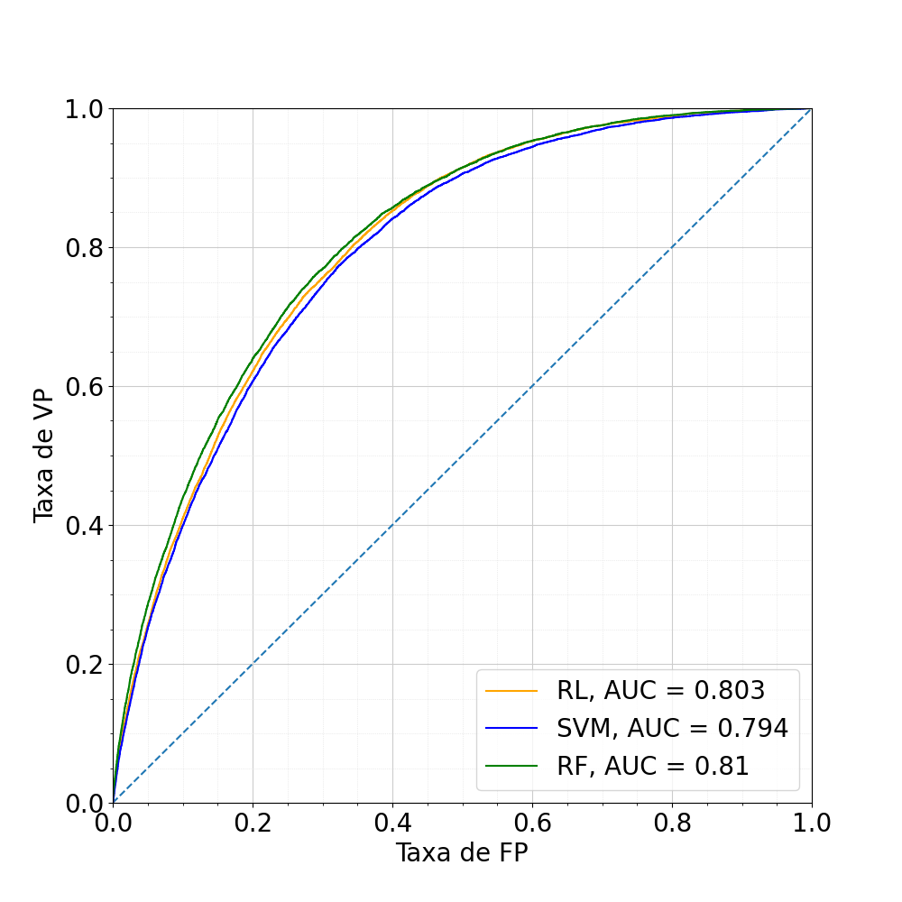
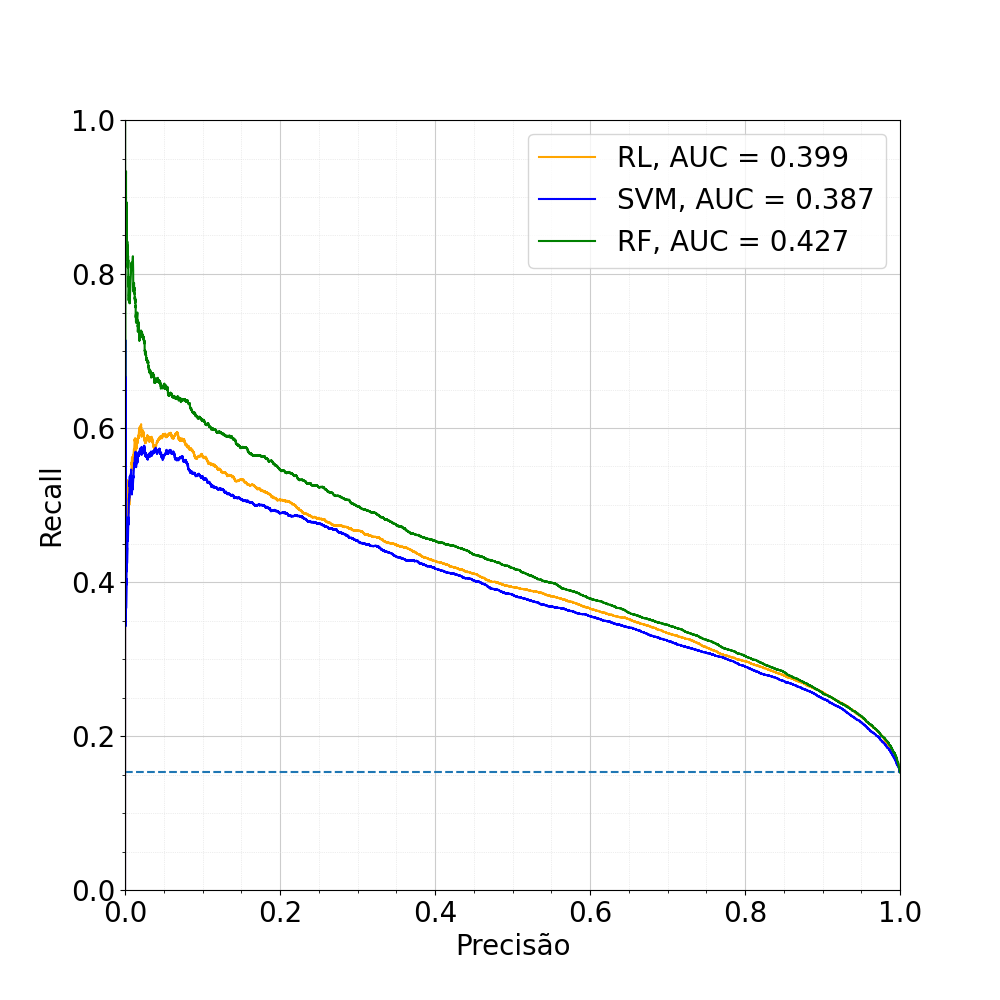

# Projeto - Classificador de Indivíduos com Diabetes

Primeiro projeto apresentado na displina de Inteligência Computacional em Saúde ministrada pelo professor [Andre Georghton Cardoso Pacheco](https://github.com/paaatcha). Os alunos envolvidos no desenvolvimento foram:
<ul>
    <li>Luiz Carlos Cosmi Filho</li>
        <a href="http://lattes.cnpq.br/7512442154273401">
            
        </a>
        <a href="mailto:luizcarloscosmifilho@gmail.com">
            
        </a>
        <a href="https://www.linkedin.com/in/luizcarloscf/">
            
        </a>
        <a href="https://github.com/luizcarloscf">
            
        </a>
    <li>Mateus Sobrinho Menines</li>
        <a href="http://lattes.cnpq.br/0283141894444882">
            
        </a>
        <a href="mailto:mateus.sobrinho09@gmail.com">
            
        </a>
        <a href="https://www.linkedin.com/in/mateus-sobrinho-868147256/">
            
        </a>
        <a href="https://github.com/MateusSMenines">
            
        </a>
</ul>

## Sumário

- [Base de dados](#base-de-dados)
- [Instalação](#instalação)
    - [Ambiente virtual](#ambiente-virtual)
    - [Obtendo o projeto](#obtendo-o-projeto)
    - [Instalando as dependências](#instalando-as-dependências)
    - [Abrindo o projeto](#abrindo-o-projeto)
- [Resultados](#resultados)
- [Licença](#licença)

## Base de dados

A base de dados utilizada nesse projeto corresponde a um questionário chamado [*Behavioral Risk Fator Surveillance System* (BRFSS)](https://www.cdc.gov/brfss/index.html) de 2015 realizado pelo CDC (*Central Disease Control*) disponível na plataforma [UCI *Machine Learning Repository*](https://archive.ics.uci.edu/) como [CDC *Diabetes Health Indicators*](https://archive.ics.uci.edu/dataset/891/cdc+diabetes+health+indicators). A base de dados é composta por 3 arquivos, sendo eles:
- `diabetes_binary_health_indicators_BRFSS2015.csv`
- `diabetes_binary_5050split_health_indicators_BRFSS2015.csv`
- `diabetes_012_health_indicators_BRFSS2015.csv`

Nesse trabalho, serão utilizados os dados `diabetes_binary_health_indicators_BRFSS2015.csv` que corresponde a um problema de **classificação binária** para o diagnóstico de diabetes, os atributos presentes na base de dados são:

            
| Atrbiuto             | Descrição                                                                                                                                                        | Valores                       |
| :---                 |     :---                                                                                                                                                         | :---                          |
| Diabetes_binary      | você tem diabetes?                                                                                                                                               | Sim (1) ou não(0)             |
| HighBP               | você tem pressão alta?                                                                                                                                           | Sim (1) ou não(0)             |
| HighChol             | você tem colesterol alto?                                                                                                                                        | Sim (1) ou não(0)             |
| CholCheck            | você realizou exame de colesterol nos últimos cinco anos?                                                                                                        | Sim (1) ou não(0)             |
| BMI                  | qual seu índice de massa muscular?                                                                                                                               | Número inteiro                |
| Smoker               | você é fumante?                                                                                                                                                  | Sim (1) ou não(0)             |
| Stroke               | você já teve um AVC?                                                                                                                                             | Sim (1) ou não(0)             |
| HeartDiseaseorAttack | você tem doença coronariana (DCC) ou infarto do miocárdio?                                                                                                       | Sim (1) ou não(0)             |
| PhysActivity         | você praticou atividade física nos últimos 30 dias?                                                                                                              | Sim (1) ou não(0)             |
| Fruits               | você consume uma ou mais frutas por dia?                                                                                                                         | Sim (1) ou não(0)             |
| Veggies              | você consume uma ou mais verduras por dia?                                                                                                                       | Sim (1) ou não(0)             |
| HvyAlcoholConsump    | você consume grandes quantidades de álcool (homens adultos que bebem mais de 14 drinques por semana e mulheres adultas que bebem mais de 7 drinques por semana)? | Sim (1) ou não(0)             |
| AnyHealthcare        | você tem algum plano de saúde?                                                                                                                                   | Sim (1) ou não(0)             |
| NoDocbcCost          | houve algum momento nos últimos 12 meses em que você precisou consultar um médico, mas não pôde por causa do custo?                                              | Sim (1) ou não(0)             |
| GenHlth              | você diria que, em geral, o quão boa é a sua saúde?                                                                                                              | Escala de 1 à 5               |
| MentHlth             | sobre sua saúde mental, que inclui estresse, depressão e problemas emocionais, por quantos dias durante os últimos 30 dias sua saúde mental não foi boa?         | Escala de 0 à 30              |
| PhysHlth             | sobre sua saúde física, que inclui doenças e lesões físicas, por quantos dias durante os últimos 30 dias sua saúde física não foi boa?                           | Escala de 0 à 30              |
| DiffWalk             | você tem muita dificuldade para andar ou subir escadas?                                                                                                          | Sim (1) ou não(0)             |
| Sex                  | qual o seu sexo?                                                                                                                                                 | Feminino (0) ou masculino (1) |
| Age                  | qual a sua idade?                                                                                                                                                | Escala de 0 à 14             |
| Education            | qual o seu nível de escolaridade                                                                                                                                 | Escala de 1 à 6               |
| Income               | qual a sua renda familiar anual?                                                                                                                                 | Escala de 1 à 8               |

> 📝 Nota: Para execução do projeto, os dados devem ser baixados no link disponibilizado acima e colocados na pasta [`data`](./data).


## Instalação

As instruções de instalação a seguir são apresentadas para o sistema operacional [Ubuntu](https://ubuntu.com/). 

> ⚠️ Aviso: Testado apenas no [Ubuntu 22.04](https://releases.ubuntu.com/jammy/).


### Ambiente virtual

O pacote `python3-venv` é necessário para criar ambientes virtuais Python. Para instalá-lo no Ubuntu 22.04, execute o seguinte comando:

```bash
sudo apt-get install python3-venv
```

### Obtendo o projeto

Agora, vamos clonar um repositório Git e criar um ambiente virtual Python:

```bash
# Baixe o projeto
git clone https://github.com/intel-comp-saude-ufes/2024-1-P1-classificador-diabetes.git

# Entre na pasta do projeto
cd 2024-1-P1-classificador-diabetes/

# Crie um ambiente virtual com nome '.venv'
python3 -m venv .venv

# Ative o ambiente virtual
source .venv/bin/activate
```

### Instalando as dependências

Uma vez no ambiente virtual, instale as dependências do projeto usando `pip`. Caso você não o tenha instalado em seu computador, basta executar:

```bash
sudo apt-get install python3-pip
```

Então, você pode prosseguir com a instalação das dependências do projeto:

```bash
pip3 install -r requirements.txt
```

### Abrindo o projeto

Para abrir os Jupyter Notebooks que contém o projeto, basta utilizar o projeto [JupyterLab computational environment](https://github.com/jupyterlab/jupyterlab) (já consta como dependência desse trabalho). Para executá-lo, basta digitar no terminal: 

```bash
jupyter-lab
```

Então, abra o browser em: [http://localhost:8888/](http://localhost:8888/). O arquivo [notebooks/project](./notebooks/project.ipynb) que contém todo o código desenvoldido do projeto.


## Resultados

A apresentação do projeto foi disponibiliza no YouTube no seguinte link:

[](https://www.youtube.com/watch?v=NB9VbvrM_QY)

Além disso, o relatório/artigo descrevendo o projjeto pode ser encontrado em [results/report.pdf](./results/report.pdf). Nele é realizada uma discussão do problema, trabalhos relacionados, metodologia, resultados e trabalhos futuros. As curvas ROC e PR dos melhores classificadores avaliados sobre a base de dados podem ser observadas a seguir.

|Curva ROC                  |  Curva PRC                 |
|:-------------------------:|:-------------------------:
  |  


Os resultados mostram que a utilização de qualquer um dos classificadores em uma aplicação em produção apresentariam resultados semelhantes. Apesar disso, algoritmo *Extreme Gradient Boosting* apresentou um melhor desempenho quando comparado aos outros (melhor média harmônica F1, maior área sobre a curva ROC e curva PRC). Assim, poderia-se utilizar o algoritmo como um indicador ao risco de desenvolver diabetes do tipo 2, alertando ao usuário sobre o risco de desenvolver a doença com base no indicadores utilizados pela base de dados.

## Licença

Este projeto é licenciado sob os termos da [licença MIT](./LICENSE) e está disponível gratuitamente.
